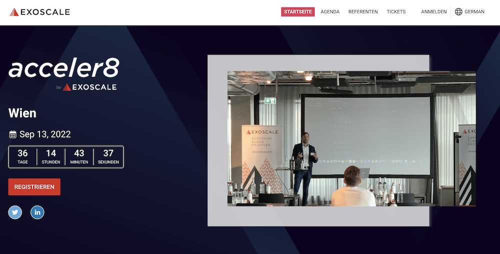
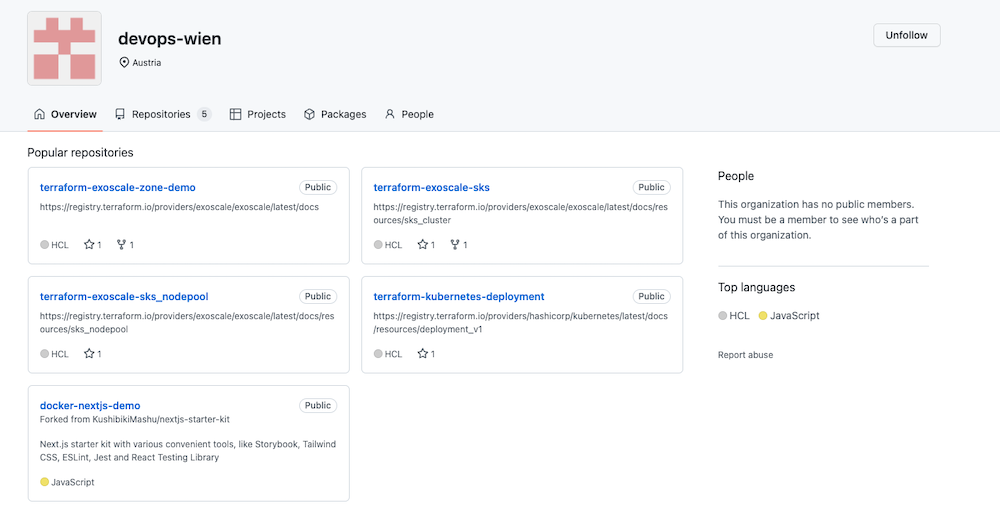
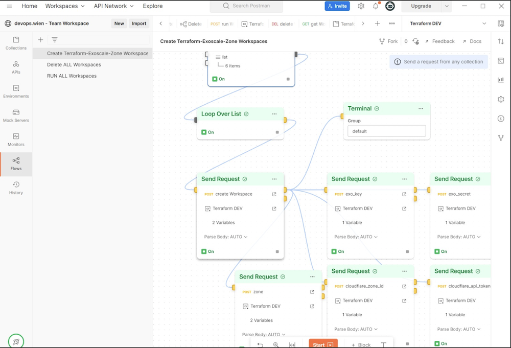
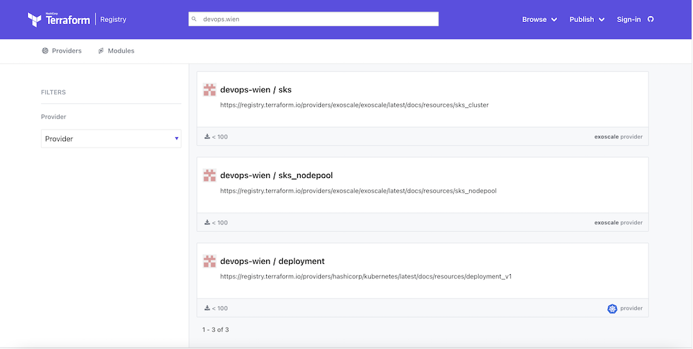
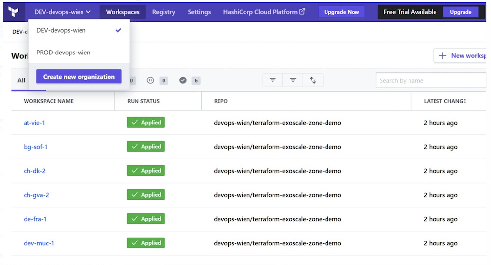
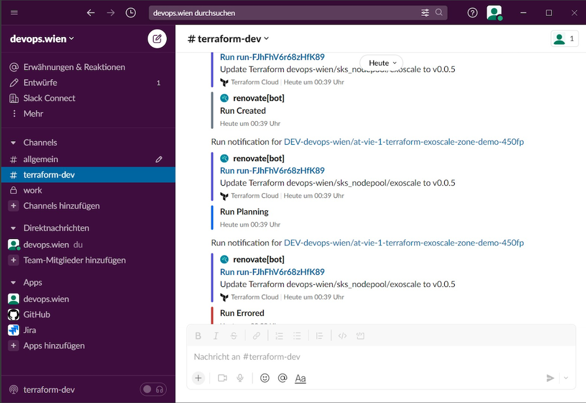
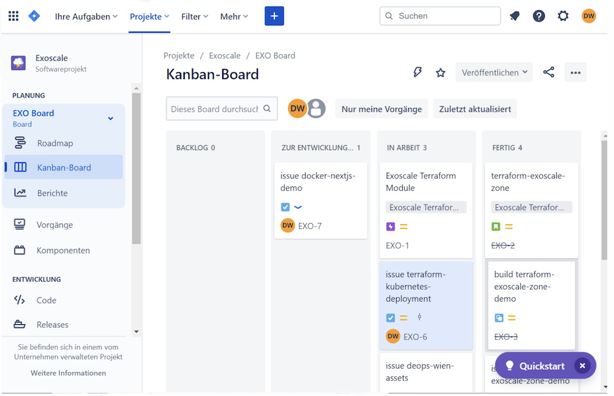
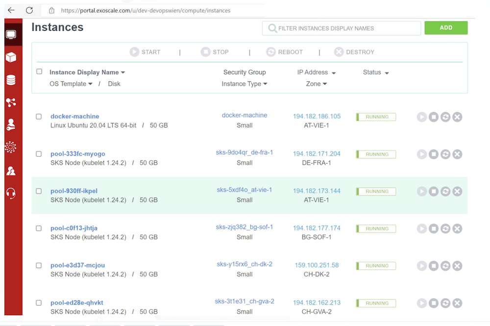
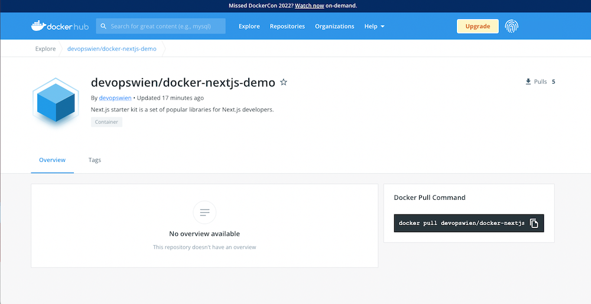

# devops-wien-media

## Live Terraform Demo - Preview

[Presentation Preview](https://docs.google.com/presentation/d/e/2PACX-1vRjMjUUr7avi567v_C9ucjiNExt3kGc4O9EbcXCnRvTnUbrMgHhar3G0y0PBAro-Gwo_AxXQIHb4MSq/pub?start=true&loop=true&delayms=3000)

## devops.wien - media assets

